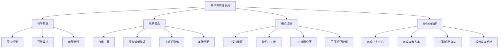

# 任正非历年讲话

## 目录

- [[#一、总体概览]]
- [[#二、关键主题与核心思想]]
- [[#三、按年份索引（1994—2025）]]
- [[#四、历年重点讲话梳理（1994—2025）]]
  - [[#1994—2000：创业成长期]]
  - [[#2001—2010：国际化与流程变革期]]
  - [[#2011—2018：消费者业务与组织进化期]]
  - [[#2019—2025：极限压力与韧性生长]]
- [[#五、经典语录摘编]]
- [[#五、管理思想体系总览]]
- [[#六、延伸阅读]]

---

## 一、总体概览

**任正非**（1944—），华为技术有限公司创始人兼CEO。自1994年首次内部讲话《华为的红旗究竟能打多久》至今，三十余年间发表数百篇讲话、文章与内部信，构成了中国企业界最系统、最具影响力的管理思想体系之一。

华为内部将这些讲话汇编为 **《华为的冬天》《北国之春》《一江春水向东流》** 等经典篇章，被视为中国企业管理的必读文献。相关研究可参考 [[华为管理变革]]、[[IPD流程体系]]。

> “一个企业需要的不只是机会，更是驾驭机会的能力。没有管理的现代化，就没有真正的现代化。” —— 任正非

---

## 二、关键主题与核心思想

### 2.1 自我批判与危机意识

贯穿始终的主线。任正非始终强调 **“华为没有成功，只有成长”** ，要求全员保持危机感。相关概念：[[自我批判文化]]、[[红蓝军对抗机制]]。

> “十年来我天天思考的都是失败，对成功视而不见，也没有什么荣誉感、自豪感，而是危机感。” ——《华为的冬天》

### 2.2 以客户为中心，以奋斗者为本

华为核心价值观的三个支柱：

| 价值观 | 内涵 |
|--------|------|
| 以客户为中心 | 为客户服务是华为存在的唯一理由 |
| 以奋斗者为本 | 不让雷锋吃亏，向奋斗者倾斜 |
| 长期艰苦奋斗 | 精神上的艰苦奋斗比物质更重要 |

参考笔记：[[华为核心价值观]]、[[华为人力资源管理纲要]]。

### 2.3 开放、妥协、灰度

任正非管理哲学的核心理念：

- **开放**：向世界学习，保持空杯心态
- **妥协**：不是软弱，而是为了目标而灵活
- **灰度**：不追求完美，在混沌中找到平衡

> “一个领导人重要的素质是方向、节奏。他的水平就是合适的灰度。” ——《开放、妥协、灰度》

### 2.4 深淘滩，低作堰

源自都江堰治水哲学，转化为经营理念：

- **深淘滩**：持续投入研发，夯实管理基础
- **低作堰**：控制利润空间，让利合作伙伴

### 2.5 力出一孔，利出一孔

聚焦战略：资源集中于主航道，不在非战略机会点上消耗战略竞争力量。参见 [[华为主航道战略]]。

---

## 三、按年份索引（1994—2025）

知识库已收录任正非 1994—2025 年 **775 篇**讲话原文，按年份目录组织，可直接点击浏览：

| 年份 | 篇数 | 年份 | 篇数 | 年份 | 篇数 | 年份 | 篇数 |
|------|------|------|------|------|------|------|------|
| [[1994]] | 6 | [[1995]] | 9 | [[1996]] | 17 | [[1997]] | 17 |
| [[1998]] | 9 | [[1999]] | 5 | [[2000]] | 7 | [[2001]] | 4 |
| [[2002]] | 1 | [[2003]] | 2 | [[2004]] | 2 | [[2005]] | 1 |
| [[2006]] | 8 | [[2007]] | 13 | [[2008]] | 14 | [[2009]] | 12 |
| [[2010]] | 8 | [[2011]] | 10 | [[2012]] | 10 | [[2013]] | 29 |
| [[2014]] | 57 | [[2015]] | 76 | [[2016]] | 70 | [[2017]] | 82 |
| [[2018]] | 58 | [[2019]] | 67 | [[2020]] | 26 | [[2021]] | 13 |
| [[2022]] | 5 | [[2023]] | 4 | [[2024]] | 1 | [[2025]] | 2 |

> 点击年份数字链接进入对应目录浏览全部讲话原文。篇数统计基于知识库实收。

---

## 四、历年重点讲话梳理（1994—2025）

### 1994—2000：创业成长期

| 时间 | 讲话/文章 | 核心内容 |
|------|-----------|----------|
| 1994 | 《华为的红旗究竟能打多久》 | 首次系统阐述华为使命，提出十年后“世界通信制造业三分天下有其一” |
| 1995 | 《目前形势与我们的任务》 | 确立农村包围城市战略，强调研发自主 |
| 1996 | 《团结起来，接受挑战》 | 应对C&C08交换机大规模商用挑战 |
| 1997 | 《华为基本法》起草相关讲话 | 推动企业管理走向制度化、规范化 |
| 1998 | 《华为的红旗还能打多久》（修订版） | 从个人英雄主义走向职业化管理 |
| 2000 | 《华为的冬天》 | **标志性文章**，在营收巅峰时发出"冬天来了"的警告，要求全员居安思危 |

> “华为的冬天可能来得很快，也可能来得慢，但一定会来。” ——《华为的冬天》2000

---

### 2001—2010：国际化与流程变革期

| 时间 | 讲话/文章 | 核心内容 |
|------|-----------|----------|
| 2001 | 《北国之春》 | 访日感悟，提出向日本企业学习精益管理与危机意识 |
| 2002 | 《认识驾驭客观规律》 | 在行业低谷期强调尊重市场规律 |
| 2003 | 《在理性与平实中存活》 | 引入IBM咨询，推动 **IPD（集成产品开发）**、ISC（集成供应链）管理变革 |
| 2004 | 《关于人力资源变革的讲话》 | 启动人力资源管理体系变革 |
| 2005 | 《关于全球化战略的讲话》 | 全面进军海外市场，提出“全球化思维，本地化行动” |
| 2006 | 《天道酬勤》 | 回顾18年奋斗历程，提出“板凳要坐十年冷”的研发精神 |
| 2007 | 《关于财经与内控管理的讲话》 | 强调财务管理对国际化的重要性 |
| 2008 | 《让听得见炮声的人做决策》 | 推动组织扁平化，权力下放到一线 |
| 2009 | 《关于干部管理的讲话》 | 建立干部选拔与淘汰机制，提出“七上八下” |
| 2010 | 《以客户为中心，以奋斗者为本》 | 核心价值观首次完整体系化表述 |

> “我们一定要让一线直接拥有决策权，而不是层层汇报。” ——《让听得见炮声的人做决策》2008

---

### 2011—2018：消费者业务与组织进化期

| 时间 | 讲话/文章 | 核心内容 |
|------|-----------|----------|
| 2011 | 《一江春水向东流》 | 回顾华为创业历程，阐述“人人股份制”与集体领导 |
| 2012 | 《关于2012实验室的讲话》 | 布局基础研究与前沿技术，构建“2012实验室” |
| 2013 | 《力出一孔，利出一孔》 | 强调聚焦主航道，不做多元化 |
| 2014 | 《做谦虚的领导者》 | 提出终端业务“活下去”而非急于追求规模 |
| 2015 | 《关于变革与创新的讲话》 | 推动“鲜花插在牛粪上”的改良式创新 |
| 2016 | 《三十年大限快到了》 | 再次拉响危机警报，呼吁组织焕新 |
| 2017 | 《华为如何迎战未来》 | 布局AI、云、智能汽车等新赛道 |
| 2018 | 《在低谷中保持信心》 | 面对国际形势变化，要求“老老实实做乌龟” |

> “华为不是一只大象，而是一群蚂蚁。蚂蚁可以扛起超过自己体重几十倍的重物。” ——《一江春水向东流》

---

### 2019—2025：极限压力与韧性生长

| 时间 | 讲话/文章 | 核心内容 |
|------|-----------|----------|
| 2019 | 《求生存，谋发展》 | 应对实体清单制裁，启动“备胎计划”全面转正 |
| 2020 | 《向上捅破天，向下扎到根》 | 强调基础研究投入，攻克“卡脖子”技术，提及[[海思半导体]]与[[鸿蒙操作系统]] |
| 2021 | 《在不确定性中寻找确定性》 | 提出系统“补洞”，构建多元化供应体系 |
| 2022 | 《梅花香自苦寒来》 | 鼓励员工在困境中坚持，强调“活下来”是第一目标 |
| 2023 | 《敢于向最高端冲锋》 | 在突破制裁后强调高端突破，加大研发投入占收入25%+ |
| 2024 | 《新时期的管理者要求》 | 推动管理架构年轻化，提出“让听得见炮声的人呼唤炮火”2.0版 |
| 2025 | 《从生存到领先》 | 站在新起点，提出“从跟随到引领”的组织能力升级 |

> “我们要向上捅破天，向下扎到根。根深才能叶茂，基础研究是华为未来的根基。” ——《向上捅破天，向下扎到根》2020

---

## 五、经典语录摘编

**关于危机与生存**

- “十年来我天天思考的都是失败，对成功视而不见。”
- “华为没有成功，只有成长。”
- “一个企业必须时刻保持清醒，在最好的时候准备过冬的棉袄。”

**关于管理与组织**

- “让听得见炮声的人做决策。”
- “砍掉高层的手脚，砍掉中层的屁股，砍掉基层的脑袋。”
- “一个清晰的方向是在混沌中产生的，是从灰度中脱颖而出的。”
- “我们提倡’胜则举杯相庆，败则拼死相救’。”

**关于技术与创新**

- “板凳要坐十年冷，文章不写一句空。”
- “在大机会时代，千万不要机会主义。”
- “华为永远不进入信息服务业，永远不进入主业以外的领域。”
- “我们要用乌龟精神，追上龙飞船。”

**关于文化与价值观**

- “资源是会枯竭的，唯有文化才会生生不息。”
- “一切工业产品都是人类智慧创造的，华为没有可以依仗的自然资源，唯有在人的头脑中挖掘出大油田、大森林、大煤矿。”
- “惟贤惟德，能服于人。”

---

## 六、管理思想体系总览

---

## 七、延伸阅读

### 关联笔记

- [[华为管理变革]] — IPD/ISC/LTC等流程变革史
- [[华为基本法]] — 企业宪法的制定与影响
- [[海思半导体]] — 华为芯片自研与备胎计划
- [[鸿蒙操作系统]] — HarmonyOS的技术架构与生态
- [[灰度哲学]] — 任正非管理哲学核心概念
- [[IPD流程体系]] — 集成产品开发方法论
- [[华为人力资源管理纲要]] — 价值创造、评价与分配体系
- [[中国企业国际化案例]] — 华为出海路径分析

### 按年份浏览全部讲话

| 目录 | 篇数 | 目录 | 篇数 | 目录 | 篇数 | 目录 | 篇数 |
|------|------|------|------|------|------|------|------|
| [[1994\|1994年讲话]] | 6 | [[1995\|1995年讲话]] | 9 | [[1996\|1996年讲话]] | 17 | [[1997\|1997年讲话]] | 17 |
| [[1998\|1998年讲话]] | 9 | [[1999\|1999年讲话]] | 5 | [[2000\|2000年讲话]] | 7 | [[2001\|2001年讲话]] | 4 |
| [[2002\|2002年讲话]] | 1 | [[2003\|2003年讲话]] | 2 | [[2004\|2004年讲话]] | 2 | [[2005\|2005年讲话]] | 1 |
| [[2006\|2006年讲话]] | 8 | [[2007\|2007年讲话]] | 13 | [[2008\|2008年讲话]] | 14 | [[2009\|2009年讲话]] | 12 |
| [[2010\|2010年讲话]] | 8 | [[2011\|2011年讲话]] | 10 | [[2012\|2012年讲话]] | 10 | [[2013\|2013年讲话]] | 29 |
| [[2014\|2014年讲话]] | 57 | [[2015\|2015年讲话]] | 76 | [[2016\|2016年讲话]] | 70 | [[2017\|2017年讲话]] | 82 |
| [[2018\|2018年讲话]] | 58 | [[2019\|2019年讲话]] | 67 | [[2020\|2020年讲话]] | 26 | [[2021\|2021年讲话]] | 13 |
| [[2022\|2022年讲话]] | 5 | [[2023\|2023年讲话]] | 4 | [[2024\|2024年讲话]] | 1 | [[2025\|2025年讲话]] | 2 |

### 推荐阅读

- 《下一个倒下的会不会是华为》—— 田涛、吴春波
- 《华为管理变革》—— 吴晓波等
- 《理念·制度·人》—— 田涛
- 《华为没有秘密》—— 吴春波
- 华为内部刊物《华为人》、《管理优化》

### 说明

> 本文档基于公开讲话、内部文章及媒体报道整理，部分内容为概括性转述。任正非讲话多以内部会议或文件形式发布，准确原文请参考华为官方正式出版物。
>
> 整理时间：2026年6月 | 持续更新中

---

*本文使用 Obsidian 标准 Markdown 语法编写，兼容主流 Markdown 渲染引擎。*
