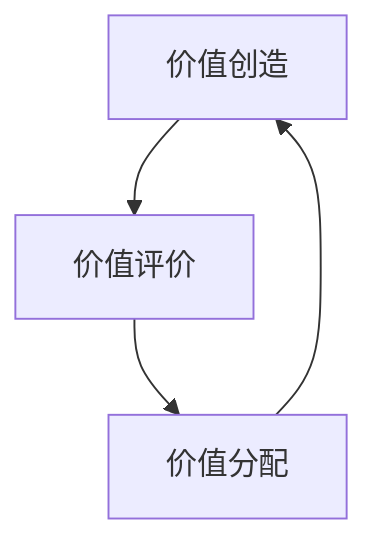

# 华为人力资源管理纲要

## 概述

华为的人力资源管理体系是任正非管理思想在"人"的维度上的系统落地。从1998年《[[华为基本法]]》到2018年《人力资源管理纲要2.0》，历经二十年演进。核心命题是：**如何激发人的创造力，同时保持组织秩序**。

> "一切工业产品都是人类智慧创造的，华为没有可以依仗的自然资源，唯有在人的头脑中挖掘出大油田、大森林、大煤矿。" —— 任正非

## 价值管理体系三循环

### 价值创造
- 以客户为中心定义价值
- 鼓励"多打粮食"的人
- 反对没有结果的苦劳

### 价值评价
- **责任结果导向**：不看过程多辛苦，看最终产出
- **赛马文化**：在实战中选拔干部
- 差异化评价：拉开优秀与一般的差距

### 价值分配
- **不让雷锋吃亏** — 向奋斗者、贡献者倾斜
- 薪酬激励：工资、奖金、股票、TUP 多元化组合
- 拉开差距：优秀员工收入可以是一般员工的数倍

## 干部管理体系

| 原则 | 内容 |
|------|------|
| 选拔制 | 从成功实践中选拔干部 |
| 能上能下 | 不作为就下，不分职级高低 |
| 循环轮岗 | 干部必须有跨领域经验 |
| 七上八下 | 70%干部从一线选拔，80%在实战中成长 |

## 人力资源管理纲要2.0（2018）

核心升级：

1. **从管控到激活**：从管住人转变为激活人
2. **差异化人才管理**：普通员工按流程走，顶尖人才给特殊通道
3. **熵减机制**：持续流动，对抗组织僵化

## 关联概念

- [[华为核心价值观]] — 人力资源体系的文化内核
- [[华为基本法]] — 人力资源体系的制度起点
- [[自我批判文化]] — 干部淘汰与激活的机制支撑
