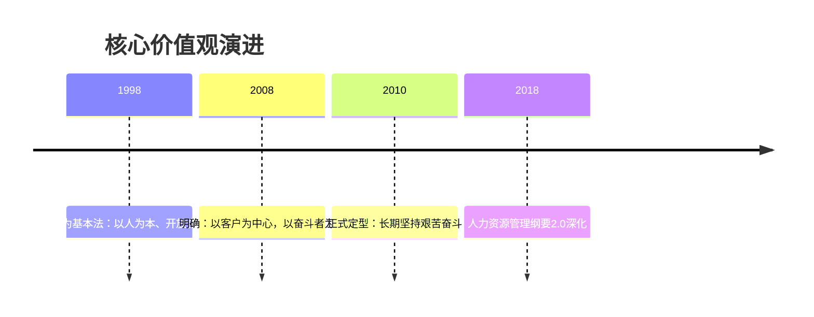

# 华为核心价值观

## 概述

华为核心价值观是任正非管理思想的核心表达，也是华为文化的纲领。经过多年演进，最终凝练为三句话：

> **以客户为中心，以奋斗者为本，长期坚持艰苦奋斗。**

## 三大支柱

### 以客户为中心

- 为客户服务是华为存在的**唯一理由**
- 客户需求是华为发展的**原动力**
- 用[[IPD流程体系]]确保客户需求驱动产品开发

> "企业能不能活下去，不是看技术有多先进，而是看有没有客户买你的东西。"

### 以奋斗者为本

- **不让雷锋吃亏** — 向奋斗者倾斜
- 激励机制设计：奖金、股票、TUP等向高绩效者倾斜
- 干部选拔：从成功实践中选拔，优先从一线选拔

### 长期坚持艰苦奋斗

- **思想上的艰苦奋斗**比体力上的更重要
- 艰苦奋斗不只是加班，而是持续学习、持续进步
- [[自我批判文化]] 是保持艰苦奋斗精神的内驱力

## 价值观演进历程

## 制度保障

- **价值评价体系**：责任结果导向
- **价值分配体系**：按贡献取酬，拉开差距
- **干部管理**：能上能下，末位淘汰

## 关联概念

- [[华为基本法]] — 核心价值观的制度化起点
- [[华为人力资源管理纲要]] — 价值观在人力资源中的落实
- [[自我批判文化]] — 核心价值观的纠偏机制
