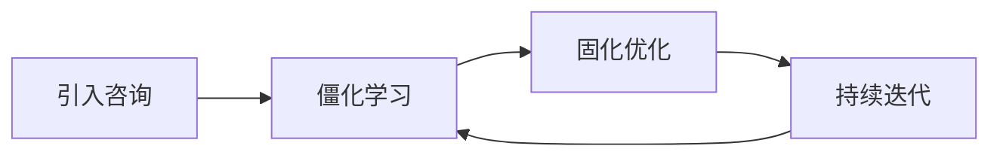

# 华为管理变革

## 概述

华为的管理变革史，是从**个人英雄主义走向职业化管理**的过程。任正非很早就意识到：企业做大的瓶颈不是市场，而是管理能力。

> "管理是华为的核心竞争力。没有管理的现代化，就没有真正的现代化。"

## 三大标志性变革

### IPD（集成产品开发）

- **时间**：1998年起，引入IBM咨询
- **核心**：从机会到商业变现的端到端流程
- **价值**：将产品开发从"技术导向"转为"客户需求导向"
- 详见 [[IPD流程体系]]

### ISC（集成供应链）

- **时间**：2000年代初期
- **核心**：打通从供应商到客户的供应链条
- **价值**：大幅降低库存成本，提升交付效率

### LTC（线索到回款）

- **时间**：2013年起
- **核心**：从销售线索到合同回款的端到端流程
- **价值**：让一线"听得见炮声的人做决策"

## 变革方法论

- **先僵化**：先照搬，不理解的也要执行
- **后固化**：融入华为实际，形成制度
- **再优化**：持续改进，自我进化

## 变革原则

1. **改良优于革命** — "鲜花插在牛粪上"式渐进改良
2. **先窄后宽** — 试点先行，成功后再推广
3. **一把手工程** — 变革必须从上往下推
4. **削足适履** — 先穿美国鞋，再换自己的鞋

## 关联概念

- [[IPD流程体系]] — 集成产品开发变革详情
- [[灰度哲学]] — 变革中的灰度管理思想
- [[华为基本法]] — 管理变革的制度起点
