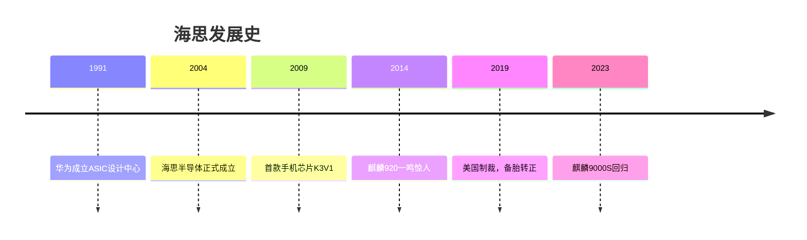

# 海思半导体

## 概述

**海思半导体**（HiSilicon）是华为旗下的半导体设计公司，成立于2004年，前身是1991年创建的华为集成电路设计中心。海思是华为"备胎计划"的核心组成，也是华为技术自主战略的关键支撑。

> "海思的使命是成为华为的技术压舱石。" —— 何庭波（海思总裁）

## 发展历程

## 关键产品线

| 系列 | 应用领域 | 代表产品 |
|------|----------|----------|
| 麒麟（Kirin） | 手机SoC | 麒麟9000S、9010 |
| 昇腾（Ascend） | AI芯片 | 昇腾910、310 |
| 鲲鹏（Kunpeng） | 服务器CPU | 鲲鹏920、916 |
| 巴龙（Balong） | 基带芯片 | 巴龙5000（5G） |
| 天罡（TianGang） | 基站芯片 | 5G基站核心 |

## 备胎转正（2019）

2019年5月16日美国将华为列入实体清单后：

- 海思总裁何庭波发布内部信：**"备胎一夜之间全部转正"**
- 十五年持续投入终到回报时刻
- 证明了任正非"在最好的时候准备过冬"的远见

## 关联概念

- [[鸿蒙操作系统]] — 海思芯片的软件生态搭档
- [[任正非历年讲话]] — 备胎战略的管理思想源头
- [[IPD流程体系]] — 海思芯片研发的流程框架

> "我们要向上捅破天，向下扎到根。根深才能叶茂，基础研究是华为未来的根基。" —— 任正非 2020
