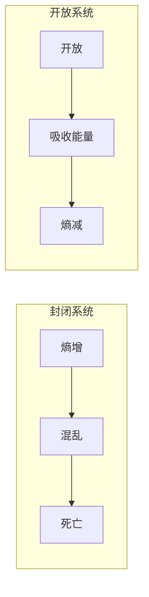

# 熵减与华为管理

## 概述

任正非将热力学第二定律的**熵（Entropy）** 概念引入企业管理：**封闭系统必然走向熵死（热寂），只有开放系统、持续做功，才能保持活力**。

> "熵减的过程是痛苦的，前途是光明的。" —— 任正非

## 核心逻辑

## 华为的熵减实践

| 维度 | 熵增表现 | 熵减手段 |
|------|----------|----------|
| 组织 | 官僚化、臃肿 | 扁平化、[[华为管理变革]] |
| 人才 | 板结、固化 | 干部轮岗、末位淘汰 |
| 文化 | 骄傲、自满 | [[自我批判文化]] |
| 技术 | 路径依赖 | 多路径探索、[[红蓝军对抗机制]] |
| 系统 | 封闭、僵化 | 开放合作、一杯咖啡吸收宇宙能量 |

## 经典论述

> "企业发展到一定阶段，就会产生熵增现象——机构臃肿、流程复杂、决策缓慢。唯一的办法就是通过管理变革，持续做熵减运动。"

> "人力资源政策要朝着熵减的方向发展。"

> "我们一定要开放，封闭的结果必然是熵死。"

## 组织熵减三大路径

1. **开放系统** — 向外界吸收能量（人才、技术、思想）
2. **持续流动** — 干部循环流动、人才新陈代谢
3. **做功** — [[华为核心价值观]]中的"长期艰苦奋斗"

## 关联概念

- [[自我批判文化]] — 熵减的文化驱动
- [[华为管理变革]] — 熵减的组织手段
- [[华为人力资源管理纲要]] — 人力资源层面的熵减机制
- [[任正非历年讲话]] — 熵减思想的讲话出处
